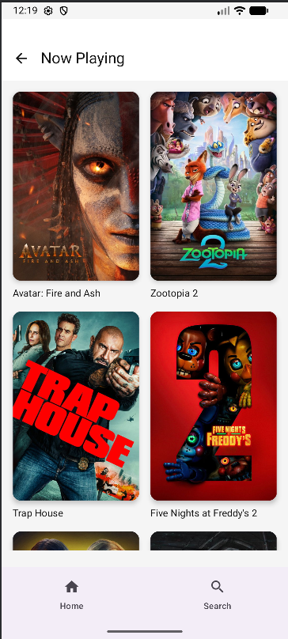
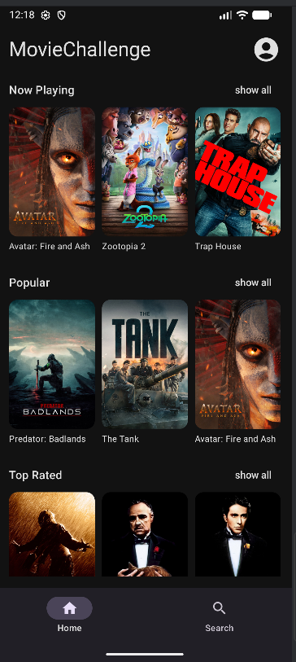
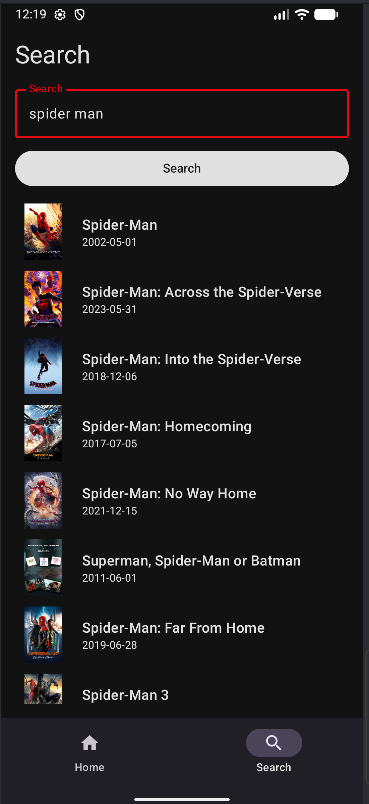

# 🎬 Movie Challenge App

Modern Android geliştirme standartları (Native Kotlin & Jetpack Compose) kullanılarak geliştirilmiş, TMDB API üzerinden film keşfi, arama ve detay görüntüleme imkanı sunan mobil uygulama.

Bu proje; **MVVM Mimarisi**, **Clean Architecture** prensipleri ve **Dependency Injection** gibi modern yazılım geliştirme pratiklerini göstermek amacıyla hazırlanmıştır.

## 📱 Özellikler

* **Keşfet:** Vizyondakiler, Popüler, En Çok Oy Alanlar ve Yakında Gelecek filmleri listeleme.
* **Arama:** Film adına göre anlık arama yapma ve sonuçları listeleme.
* **Detaylar:** Filmlerin posteri, özeti, puanı ve yayın tarihi gibi detaylarını görüntüleme.
* **Çoklu Dil Desteği (Localization):** Cihaz diline göre otomatik Türkçe veya İngilizce içerik.
* **Tema Desteği:** Sistem ayarına duyarlı Karanlık (Dark) ve Aydınlık (Light) mod + uygulama içi manuel geçiş.

## 🛠 Kullanılan Teknolojiler ve Kütüphaneler

Geliştirme sürecinde modern, sürdürülebilir ve test edilebilir bir yapı oluşturmak için aşağıdaki teknolojiler tercih edilmiştir:

* **Dil:** [Kotlin](https://kotlinlang.org/)
* **UI Toolkit:** [Jetpack Compose](https://developer.android.com/jetbrains/compose) (Material3)
* **Mimari:** MVVM (Model-View-ViewModel) + Clean Architecture
* **Dependency Injection:** [Hilt](https://dagger.dev/hilt/) (Bağımlılıkların yönetimi ve test edilebilirlik için)
* **Network:** [Retrofit](https://square.github.io/retrofit/) & [OkHttp](https://square.github.io/okhttp/) (API istekleri için)
* **Veri Formatı:** GSON (JSON verisini Kotlin nesnelerine dönüştürmek için)
* **Görüntü Yükleme:** [Coil](https://coil-kt.github.io/coil/) (Asenkron resim yükleme ve önbellekleme için)
* **Asenkron İşlemler:** Kotlin Coroutines & Flow
* **Navigasyon:** Jetpack Compose Navigation
* **Test:** JUnit4, Mockk, Coroutines Test

## 📐 Tasarım Kararları (Design Decisions)

1.  **Clean Architecture:** Proje; `Data` (Veri), `Domain` (İş Mantığı) ve `Presentation` (Arayüz) olmak üzere üç ana katmana ayrıldı. Bu sayede iş mantığı Android framework'ünden bağımsız hale getirildi ve birim testlerin yazılması kolaylaştı.
2.  **MVVM Pattern:** UI (Screen) ile İş Mantığını (ViewModel) birbirinden ayırmak için kullanıldı. UI State yönetimi `StateFlow` kullanılarak reaktif bir şekilde ele alındı.
3.  **Repository Pattern:** Veri kaynağı (API) ile ViewModel arasına bir soyutlama katmanı konularak verinin kaynağının yönetimi merkezileştirildi.
4.  **UI/UX:** Kullanıcı deneyimini artırmak için büyük listelerde performanslı olan `LazyColumn` ve `LazyRow` kullanıldı. Görsel hiyerarşi için Material3 standartlarına uyuldu. Karanlık mod desteği ile göz yorgunluğunu azaltacak renk paleti seçildi.

## 📸 Ekran Görüntüleri

| Ana Sayfa (Light) | Ana Sayfa (Dark) | Arama Ekranı |
|:---:|:---:|:---:|
|  |  |  |

*(Not: Ekran görüntüleri `screenshots` klasöründe bulunmaktadır.)*


## 🎥 Uygulama Demosu

Uygulamanın çalışır halini ve animasyonlarını incelemek için aşağıdaki videoyu izleyebilirsiniz:

[▶️ Demo Videosunu İzlemek İçin Tıkla](https://youtu.be/xuGnZQHWcBM)

## ✅ Testler

Uygulamanın kritik iş mantığını içeren ViewModel katmanı için **Unit Testler** yazılmıştır.
Testleri çalıştırmak için:
```bash
./gradlew test